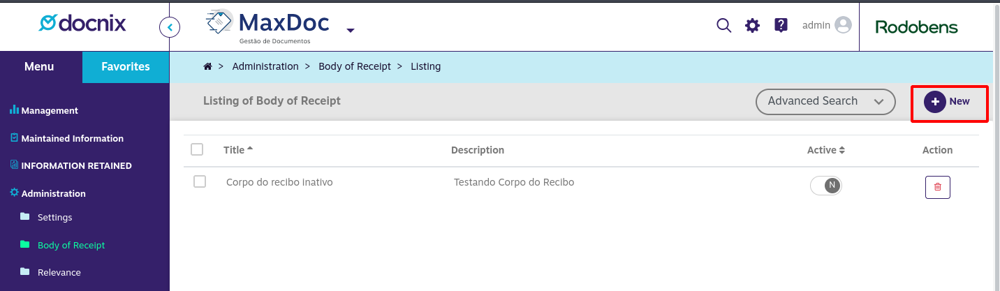
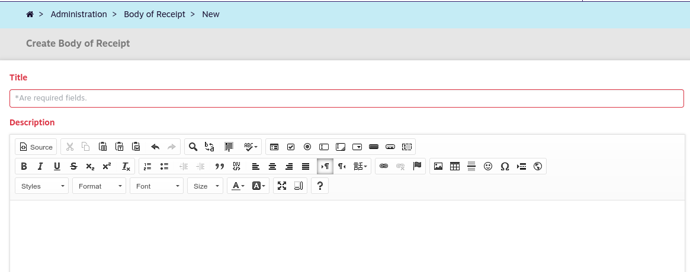

# Receipt Body

With this functionality, you can register several models of receipts that can be used in the process of proving receipt of copies controlled by the recipients of the copies at your destination.

1\) Access the Administration menu, receipt body submenu:

2\) Click the New option:

3\) The system will submit the form for inclusion of a new receipt. Fill in the information and click Save

