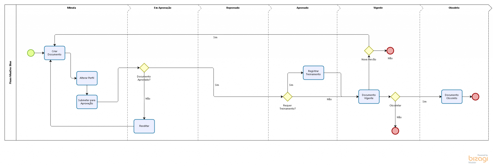

# Overview

#### Objective

The MaxDoc module provides effective control over the process of creating, reviewing, approving and publishing documents to be shared by the people who make up an organization.

In addition, it efficiently controls the life cycle of all documents produced by the company, in order to demonstrate, in different views, the stage in which each document is.

It also controls the reading of all documents in order to enable the issuance of reading receipts, with the possibility of easy control of the copies issued of the document, in a controlled and uncontrolled way.

#### Benefits

* Automation of approval and signatures flow.
* Faster when creating, approving, versioning and obsoleting a document.
* Process rigorously recorded, so it is possible to know when, by whom and from which IP changes were made to the document and its flow.
* Reduction of physical space expense to store documents.
* Creation of controlled copies and recording of when they were issued and to whom they were sent.

#### Process

